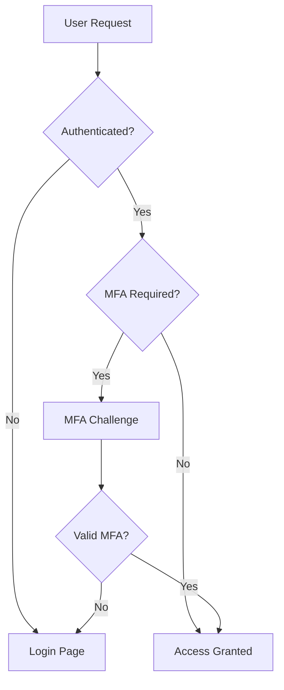

# User Guide Structural Analysis & Recommendations

## Current Document Analysis

### Document Statistics
- **Total Lines**: 5,812 lines
- **Total Words**: 15,859 words  
- **Total Characters**: 172,321 characters
- **Sections**: 16 main sections
- **File Size**: ~168 KB

### Current Structure Strengths ✅
1. **Comprehensive Coverage**: All essential topics are covered from installation to production deployment
2. **Logical Flow**: Sections follow a natural progression from setup to advanced topics
3. **Rich Code Examples**: Extensive code samples throughout with practical examples
4. **Clear Headers**: Well-organized with numbered sections and descriptive titles
5. **Production-Ready Content**: Includes deployment, monitoring, and troubleshooting sections

### Areas for Improvement 🔧

## Recommended Structural Changes

### 1. **Split Into Multiple Documents** 📚
The current single file is quite large (5,812 lines). Consider splitting into:

```
docs/
├── README.md                      # Overview and quick start
├── user-guide/
│   ├── 01-introduction.md        # Introduction and overview
│   ├── 02-installation.md        # Prerequisites and installation
│   ├── 03-configuration.md       # Initial setup and configuration
│   ├── 04-basic-operations.md    # Basic operations
│   ├── 05-user-management.md     # User management
│   ├── 06-multi-tenancy.md       # Organization and multi-tenancy
│   ├── 07-security.md            # Security features
│   ├── 08-api-guide.md           # API usage and documentation
│   ├── 09-analytics.md           # Analytics and monitoring
│   ├── 10-compliance.md          # Compliance features
│   ├── 11-advanced-config.md     # Advanced configuration
│   ├── 12-development.md         # Development and extensions
│   ├── 13-deployment.md          # Production deployment
│   ├── 14-troubleshooting.md     # Troubleshooting guide
│   └── 15-reference.md           # Quick reference and common issues
├── api-reference/
│   ├── authentication.md         # API authentication methods
│   ├── endpoints.md              # Complete endpoint reference
│   └── examples.md               # API usage examples
├── tutorials/
│   ├── quick-start.md           # 5-minute quick start
│   ├── first-app.md             # Building your first app
│   └── production-deploy.md     # Deploy to production
└── reference/
    ├── configuration.md          # Configuration reference
    ├── environment-vars.md       # Environment variables
    ├── cli-commands.md          # Management commands
    └── troubleshooting.md      # Troubleshooting reference
```

### 2. **Add Visual Elements** 🎨

#### Missing Visual Components:
- **Architecture Diagrams**: System architecture, data flow diagrams
- **Screenshots**: Admin interface, API documentation, dashboard views
- **Flowcharts**: Authentication flow, deployment process, workflow engine
- **Tables**: Feature comparison, configuration options, API endpoints summary

#### Suggested Diagram Additions:
```markdown
## System Architecture Diagram


## Authentication Flow


### 3. **Improve Navigation** 🧭

#### Add Navigation Elements:
```markdown
<!-- At the top of each section -->
[← Previous: Installation](./02-installation.md) | [Home](./README.md) | [Next: Configuration →](./03-configuration.md)

<!-- Add a searchable index -->
## Index
- API Keys: [Security Features](#api-key-management), [API Usage](#authentication-methods)
- Authentication: [User Management](#authentication), [API Auth](#api-authentication)
- Compliance: [GDPR](#gdpr-compliance), [HIPAA](#hipaa-compliance)
...
```

### 4. **Add Quick Reference Cards** 📋

Create summary cards for common tasks:

```markdown
## Quick Reference Cards

### 🚀 Quick Start Card
| Task | Command | Notes |
|------|---------|-------|
| Install | `pip install -r requirements.txt` | Use virtual environment |
| Migrate | `python manage.py migrate` | Run after installation |
| Create Admin | `python manage.py createsuperuser` | Required for admin access |
| Run Server | `python manage.py runserver` | Development only |
| Run Tests | `pytest` | Requires test database |

### 🔒 Security Checklist Card
- [ ] Change SECRET_KEY in production
- [ ] Enable HTTPS (SSL/TLS)
- [ ] Configure ALLOWED_HOSTS
- [ ] Set up database credentials
- [ ] Enable MFA for admin users
- [ ] Configure rate limiting
- [ ] Set up monitoring
```

### 5. **Enhance Code Examples** 💻

#### Current Issues:
- Some code blocks are very long
- Missing language hints for some blocks
- No "copy" button functionality mentioned

#### Improvements:
```markdown
<!-- Add language hints consistently -->
```python
# Good - has language hint
def example():
    pass
```

<!-- Add runnable example indicators -->
```bash
# Run this example
$ python manage.py shell
>>> from foundation.apps.accounts.models import User
>>> User.objects.count()
```

<!-- Add expected output -->
```python
# Example with expected output
result = calculate_metrics()
print(result)
# Output: {'users': 150, 'active': 120, 'retention': 0.80}
```

### 6. **Add Version Information** 📌

```markdown
## Version Compatibility

| Foundation Version | Django | Python | PostgreSQL | Redis |
|-------------------|--------|--------|------------|-------|
| 1.0.x             | 5.0+   | 3.11+  | 13+        | 6.0+  |
| 0.9.x             | 4.2+   | 3.10+  | 12+        | 5.0+  |

⚠️ **Note**: This guide is for Foundation v1.0.x
```

### 7. **Improve Error Messages Section** ⚠️

Add a dedicated error reference:

```markdown
## Common Error Reference

### Error: Connection refused to Redis
**Symptoms**: `redis.exceptions.ConnectionError`
**Cause**: Redis server not running
**Solution**: 
```bash
# Start Redis
sudo systemctl start redis
# Or Docker
docker run -d -p 6379:6379 redis
```

### Error: Migration conflicts
**Symptoms**: `django.db.migrations.exceptions.InconsistentMigrationHistory`
**Cause**: Database state doesn't match migrations
**Solution**: See [Migration Troubleshooting](#migration-issues)
```

### 8. **Add Interactive Elements** 🎯

Consider adding:
- **Checklists** for deployment steps
- **Decision trees** for choosing configurations
- **Interactive CLI examples** with expected prompts
- **Progress indicators** for multi-step processes

### 9. **Create a Style Guide** 📝

Ensure consistency with:
```markdown
## Documentation Style Guide

### Headers
- H1 (#): Document title only
- H2 (##): Main sections (numbered)
- H3 (###): Subsections
- H4 (####): Sub-subsections

### Code Blocks
- Always include language identifier
- Keep examples under 50 lines
- Add comments for complex logic
- Include import statements

### Formatting
- **Bold**: Important concepts, warnings
- *Italic*: File names, emphasis
- `Code`: Inline code, commands, variables
- > Blockquote: Important notes, tips
```

### 10. **Add Metadata and Front Matter** 📄

```yaml
---
title: Enterprise SaaS Foundation User Guide
version: 1.0.0
last_updated: 2024-01-20
authors: 
  - Foundation Team
license: MIT
tags: [django, saas, enterprise, backend, python]
---
```

## Specific Content Improvements

### 1. **Consolidate Redundant Sections**
- Merge "Troubleshooting Guide" and "Common Issues" into one comprehensive troubleshooting section
- Combine similar authentication content from multiple sections

### 2. **Add Missing Topics**
- Backup and disaster recovery procedures
- Performance tuning guide
- Upgrade/migration guide between versions
- Integration testing strategies
- Load testing procedures

### 3. **Improve Code Organization**
- Group all imports at the beginning of code examples
- Use consistent naming conventions
- Add type hints to Python examples
- Include error handling in examples

### 4. **Enhance Security Section**
- Add security audit checklist
- Include penetration testing guide
- Add incident response procedures
- Include security best practices summary

## Implementation Priority

### High Priority (Do First) 🔴
1. Split document into multiple files
2. Add table of contents with links
3. Fix code block language identifiers
4. Add quick reference cards

### Medium Priority (Do Next) 🟡
1. Add visual diagrams
2. Create navigation elements
3. Consolidate redundant sections
4. Add version compatibility table

### Low Priority (Nice to Have) 🟢
1. Add interactive elements
2. Create video tutorials
3. Add search functionality
4. Build automated documentation tests

## File Structure Template

Here's a template for the split files:

```markdown
<!-- 01-introduction.md -->
# Introduction

[← Table of Contents](./README.md) | [Next: Installation →](./02-installation.md)

## Table of Contents
- [What is the Enterprise SaaS Backend Foundation?](#what-is)
- [Key Benefits](#key-benefits)
- [Who Should Use This Guide?](#who-should-use)
- [Prerequisites](#prerequisites)

---

## What is the Enterprise SaaS Backend Foundation? {#what-is}

[Content here...]

---

**Navigation**: [← Table of Contents](./README.md) | [Top ↑](#) | [Next: Installation →](./02-installation.md)
```

## Summary

The user guide is comprehensive and well-written but would benefit from:
1. **Breaking into smaller, focused documents** for better maintainability
2. **Adding visual elements** for better understanding
3. **Improving navigation** with links and search
4. **Including quick reference materials** for common tasks
5. **Enhancing code examples** with better formatting and outputs

These improvements would transform the guide from a single large document into a professional, maintainable documentation system suitable for an enterprise product.
